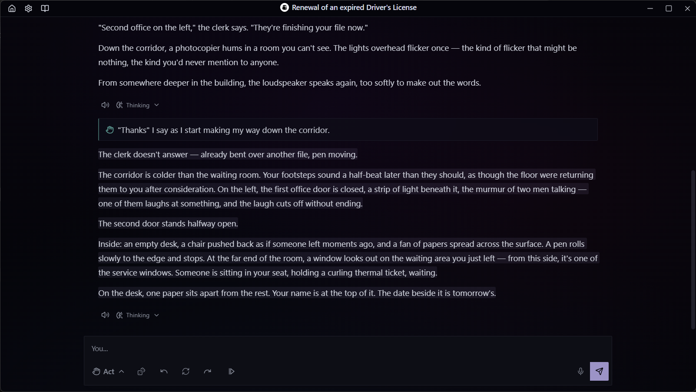
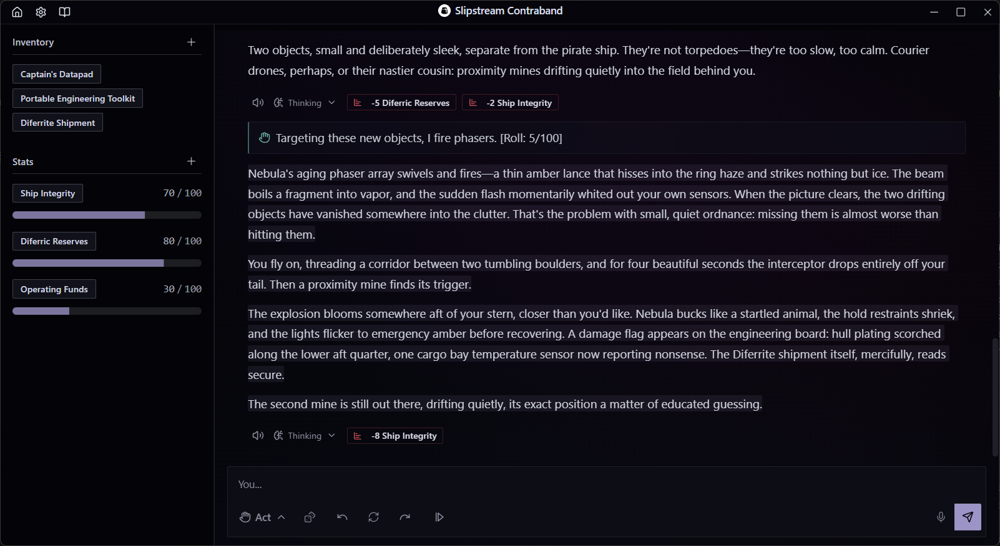

<h1 align="center">Hakawati</h1>

<p align="center">
  <a href="https://www.gnu.org/licenses/gpl-3.0"></a>
  <a href="https://github.com/rakanssh/hakawati/releases/latest"></a>
  <a href="https://github.com/rakanssh/hakawati/releases"></a>
</p>

Hakawati is a free and open-source AI adventure client for Windows, macOS, and
Linux. It works with your own AI provider or local model. Tales and scenarios are
stored on your device; an optional account adds cloud sync and scenario publishing.

[Download](https://github.com/rakanssh/hakawati/releases/latest) ·
[Website](https://hakawati.dev) · [Changelog](CHANGELOG.md) ·
[Report a bug](https://github.com/rakanssh/hakawati/issues)

- [Game modes](#game-modes)
- [Getting started](#getting-started)
- [Tales and scenarios](#tales-and-scenarios)
- [Accounts and cloud](#accounts-and-cloud)
- [Development](#development)
- [Support and license](#support-and-license)

## Game modes

### Story Teller

Freeform storytelling without inventory or stat tracking. The AI narrates the
story in response to your actions, dialogue, and directions.



### Game Master

The AI narrates and updates your character's inventory and stats. This mode is
experimental and requires a model that supports tool calling. Results depend on
how well the model handles those instructions.



## Getting started

1. Install the [latest release](https://github.com/rakanssh/hakawati/releases/latest)
   for your operating system.
2. Open **Settings → AI Setup**. Select a provider, enter its API key if needed,
   and choose a **Narrator** model. For a local server, select **Local** and use
   **Rescan**, or enter its OpenAI-compatible base URL.
3. Configure a **Utility** model for Quickstart, scenario generation, and story
   card generation. It can use the same provider and model as the narrator.
4. Use **Quickstart** on Home to generate a tale, or open a scenario and choose
   **Start Tale**.

Hakawati does not include a model or API credits. Requests go to the provider or
local server you configure. Provider presets include OpenRouter and OpenAI;
**Generic OpenAI** supports other compatible endpoints. Local tools such as
LM Studio, Ollama, and LocalAI need their model server running before connecting.

During play, the input modes are **Act**, **Say**, **Story**, and **Direct**.
**Continue** lets the narrator carry on without new input. You can edit passages,
retry a response, and undo or redo turns. Tales save automatically and are
available from the **Tales** library.

Optional **Speech to Text** and **Text to Speech** models in AI Setup provide
dictation and spoken narration. Interface language, themes, and reading settings
are under **Appearance**.

## Tales and scenarios

A tale is an ongoing adventure. A scenario is a reusable starting point for new
tales, including its opening, world details, and initial character state.

The **Scenarios** library has **Create**, **Generate**, and **Import** actions.
Import reads a scenario's JSON from the clipboard; **Export JSON** in a scenario's
menu copies it back to the clipboard for sharing.

### Editing a scenario

The editor keeps the scenario's name, description, cover, and story content in
one draft.

| Field                                    | Purpose                                                                                                             |
| ---------------------------------------- | ------------------------------------------------------------------------------------------------------------------- |
| Name, description, and cover             | How the scenario appears in your library and the public catalog. The description is not sent to the AI.             |
| AI Instructions, Plot, and Author's Note | Instructions and context used by the narrator.                                                                      |
| Opening Text                             | The first passage shown when a tale starts.                                                                         |
| Game mode                                | Story Teller or Game Master.                                                                                        |
| Stats and inventory                      | The starting character state for Game Master mode.                                                                  |
| Story cards                              | Notes about characters, places, things, and concepts, with triggers or pinning to include them in the AI's context. |

**Save draft** keeps changes local. **Publish** or **Publish update** opens a
preview of the name, description, and cover, then publishes the whole draft with
your chosen tags. Later edits stay in the draft until you publish another update.
Cover images are optimized automatically before upload.

Each new tale gets its own copy of the scenario. Editing a scenario does not
rewrite existing tales. During play, **Tale Settings** contains **Story**,
**Story Cards**, and, in Game Master mode, **Character** settings.

### Scenario questions

Scenarios can ask for a name, background, or other choices before a tale starts:

```text
Your name is ${What is your name?}.
Your ship is ${What is your ship's name? | options: The Skipper, Nebula}.
```

Answers replace the placeholders in the new tale. Repeated questions reuse the
same answer, and the original scenario stays unchanged. These are text
placeholders, not executable scripts. See [Scenario questions](SCENARIO_QUESTIONS.md)
for supported fields, fixed choices, and escaping.

## Accounts and cloud

Local play and scenario editing need no Hakawati account. **Discover** also lets
you browse public scenarios and start tales without signing in.

An account enables tale sync and scenario publishing. Sign-in and sync controls
are under **Settings → Account & Sync**.

- Existing tales can be selected individually for sync or kept local.
- When sync is enabled, new tales sync by default. **Start Local** on a scenario
  or **Keep this tale local only** in Quickstart keeps that tale on your device.
- **Remove from cloud** keeps the local copy. Conflicting saves can be reviewed
  before choosing which version to keep.
- Published scenarios are public and moderated. A tale started from one is a
  local copy; changes to the published scenario do not alter that tale.

A Hakawati account does not provide AI inference or replace your model provider.
Hosted-service details are covered by the [Privacy Policy](https://hakawati.dev/privacy),
[Terms of Service](https://hakawati.dev/terms), and
[Community Guidelines](https://hakawati.dev/community-guidelines).

## Development

### Prerequisites

- Node.js 22.12 or newer and npm.
- The stable Rust toolchain and the platform dependencies in
  [Tauri's prerequisites](https://v2.tauri.app/start/prerequisites/).
- [`cargo-about`](https://github.com/EmbarkStudios/cargo-about) for bundled license
  notices.

### Run the desktop app

```sh
git clone https://github.com/rakanssh/hakawati.git
cd hakawati
npm ci
cargo install cargo-about --locked
npm run licenses:generate
npm run tauri dev
```

For hosted services in a development or local build, add this to `.env.local`:

```dotenv
VITE_HAKAWATI_SYNC_SERVER_URL=https://api.hakawati.net
```

This is the default cloud-service URL, not an AI provider URL or a secret. Leave
it unset for local-only development. Official release builds get it from the
GitHub `production` environment.

### Build locally

```sh
npm run tauri -- build --config src-tauri/tauri.test.conf.json -- --locked
```

This configuration disables updater-signing artifacts for local builds. The build
generates the frontend and license notices, then writes the executable and installers under
`src-tauri/target/release/` and `src-tauri/target/release/bundle/`.

Official tagged releases use the signing configuration in
[the release workflow](.github/workflows/release.yml).

### Browser preview

```sh
npm run dev:browser
```

Open [http://127.0.0.1:1422](http://127.0.0.1:1422). This UI development preview
uses disposable sample tales and scenarios in an in-memory SQLite database,
with scripted narration. Reloading resets the sample data.

It needs no Rust runtime, account, or API key and cannot access desktop saves.
Live AI calls, cloud features, audio, and native updates are unavailable in this
preview. Normal desktop and release builds use the native integrations.

### Checks

```sh
npm run typecheck
npm run lint
npm run test:run
npm run build
cargo test --locked --manifest-path src-tauri/Cargo.toml
```

The client uses React 19, TypeScript, Vite, Tailwind CSS, shadcn/ui, TanStack
Router, and Zustand. Tauri 2 provides the desktop runtime, with SQLite for local
tales and scenarios.

## Support and license

Bug reports and feature requests go to
[GitHub Issues](https://github.com/rakanssh/hakawati/issues). Account, privacy, and
other support requests can be sent to [support@hakawati.net](mailto:support@hakawati.net).

Hakawati is licensed under the [GNU GPL v3.0 or later](LICENSE).
Third-party license notices ship with desktop builds in the `LICENSES/` directory.
`npm run licenses:generate` refreshes those reports.

© 2025–2026 Rakan AlShammari
