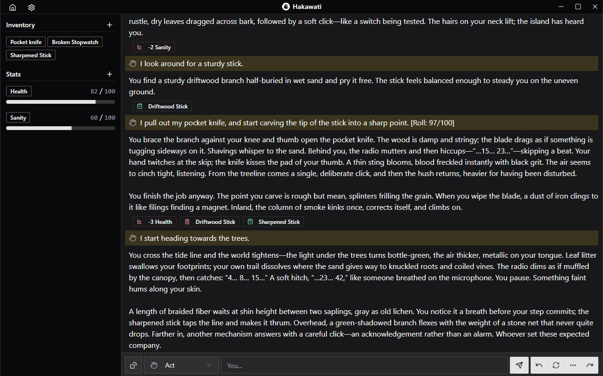

# Hakawati

[](https://www.gnu.org/licenses/gpl-3.0)
[](https://github.com/rakanssh/hakawati/releases/latest)
[](https://github.com/rakanssh/hakawati/releases)

Hakawati is an AI-powered, text-based RPG. Bring your own OpenAI-Compatible endpoint (Cloud or local), and start an on-demand, interactive, text-based adventure!

> ℹ️ The client is in an early experiment stage. Expect bugs! (Ctrl+R will refresh the app, may resolve the occasional issue.)

[📥 Download Latest Release Here](https://github.com/rakanssh/hakawati/releases/latest)

## Table of Contents

- [Game Modes](#game-modes)
- [Features](#features)
- [How to Play](#how-to-play)
  - [Install](#install)
  - [Setup](#setup)
  - [Getting an Inference endpoint](#getting-an-inference-endpoint)
  - [Create a Tale](#create-a-tale)
  - [Create or Import a Scenario](#create-or-import-a-scenario)
  - [Manage Tales](#manage-tales)
  - [Export a Scenario](#export-a-scenario)
  - [Edit a Scenario](#edit-a-scenario)
- [Getting Started (For Development)](#getting-started-for-development)
  - [Prerequisites](#prerequisites)
  - [Installation](#installation)
- [Running and Building the App](#running-and-building-the-app)
- [Project Structure](#project-structure)
- [Tech Stack](#tech-stack)
- [Roadmap](#roadmap)
- [License](#license)

## Game Modes

- Game Master Mode
  
- Story Teller Mode
  

## Features

- Two gamemodes:
  - StoryTeller: Standard AI text-based adventure.
  - GameMaster: The game keeps track of items and statistics, allowing the AI to represent and remember the current state of your character. Stats can be any numeric value with a minimum and maximum. (Experimental — best with more capable models.)
- Different prompt types: `Do`, `Say`, `Story`, `Direct` or `Continue`.
- Self-contained application — download (or build) and run.
- Supports OpenAI-compatible endpoints (including OpenRouter metadata such as pricing/token limits). Works with local servers and tools like Ollama, LocalAI, and LLM Studio. (Remember to enable CORS when required.)
- Scenario builder to create and save templates for new tales. Supports sharing scenarios via import/export to the clipboard.
- Persistence using an easily editable/queryable local SQLite database.
- Flexible model configuration with adjustable sampling parameters.

## How to Play

### Install

Download the latest release for your operating system from the [Releases page](https://github.com/rakanssh/hakawati/releases/latest).

### Setup

On first launch, follow the home screen prompt to navigate to the settings tab, setup your API URL and key if it requires one. (OpenAI-compatible endpoints are supported. click scan to detect local servers.)

#### Getting an Inference endpoint

The client supports OpenAI-compatible endpoints. There are two main straightforward ways to get an OpenAI-compatible endpoint for the client:

- **Cloud Providers:** Check each provider for their pricing, limits, and privacy policies.
- **Local Servers:** Run open LLMs on your own hardware using tools that expose a local server.

**Example Cloud Providers:**

- OpenRouter: [https://openrouter.ai](https://openrouter.ai)
  A good option if you want to use models from various providers without having to sign up for each one. Has multiple free providers. (Check their website for more details). Note that free providers often collect your prompts.
- OpenAI: [https://platform.openai.com](https://platform.openai.com)
  The official OpenAI API.
- Many others...

**Example Local tools:**

- LocalAI: [https://localai.io](https://localai.io)
- LLM Studio: [https://lmstudio.ai](https://lmstudio.ai)
- Ollama: [https://ollama.com](https://ollama.com)
- Many others...

I've tested with these tools and they work, anything that exposes an OpenAI-compatible endpoint should work too. Reach out if you find one that doesn't.
Check your chosen tool's documentation for how to enable the server, you may need to enable CORS too.

### Create a Tale

You can get started right away by clicking `Quickstart` on the home page and following the on-screen instructions to create a new tale by defining your character, setting, and tone. This will give you a tale with data based on your choices, the resulting description and author note can be changed at any time from the settings tab while in the tale.

You can also create, share, and import scenarios that act as templates for new tales allowing further customization.

### Create or Import a Scenario

Click `Scenarios` to navigate to the scenario page. You can create a new scenario from scratch `Create Scenario` or import one from the clipboard `Import From Clipboard`.

Scenario Fields:

- **Name**: The name of the scenario. Used to identify it.
- **Thumbnail**: A thumbnail image for the scenario. (Optional)
- **Initial Description**: A description of the scenario passed to the LLM with every action. Can be customized per tale.
- **Initial Author Notes**: A note directing how the AI should write the story. Can be customized per tale.
- **Opening Text**: The initial text at the start of the tale.
- **Initial Game Mode**: The game mode new tales will start in.(`Story Teller` or `Game Master`)
- **Initial Stats**: A list of stats that the AI can use to track the state of the scenario.(Used only in `Game Master` mode.)
- **Initial Inventory**: A list of items that the AI can use to track the state of the scenario.(Used only in `Game Master` mode.)
- **Initial Story Cards**: A list of story cards that the AI can use to track the state of the scenario.

These fields can be customized per tale from the settings tab after creating a new tale. The values in the scenario will be used as initial values for new tales created from it.

### Create a Tale

From the scenario page, click `New Tale` on a scenario card to create a new tale from it. The tale will be saved automatically on every action.

### Manage Tales

From the home page, click `Tales` to navigate to the tales page. You can continue or manage existing tales from here.

### Export a Scenario

Click the three dot menu on a scenario and click `Export JSON` to copy the scenario to the clipboard. The scenario can then be shared with others to be imported into their client.

### Edit a Scenario

Click the three dot menu on a scenario and click `Edit` to edit its values.

## Getting Started

### Prerequisites

- Node.js 20+ and npm
- Rust toolchain and platform dependencies required by [Tauri](https://tauri.app/start/prerequisites/)
- [`cargo-about`](https://github.com/EmbarkStudios/cargo-about) CLI (`cargo install cargo-about --locked`)

### Installation

```bash
npm install
```

## Running and Building the App

- Desktop app preview: `npm run tauri dev`
- Build: `npm run tauri build`
- Refresh license reports manually: `npm run licenses:generate`

On first launch, follow the home screen prompt tosetup your API URL and key if applicable, then select a model from the list.

## Project Structure

- `app/` – React + Vite UI, including components, pages, Zustand stores, hooks, and LLM services
- `src-tauri/` – Rust backend, Tauri configuration, and SQLite migrations.
- `public/` – Static assets bundled with the web build
- `dist/` – Generated production assets (do not edit manually)

## Tech Stack

- React 19, Vite, shadcn/ui, and Tailwind for the front-end.
- TanStack Router for navigation and layout composition.
- Zustand for client-side state and persistence.
- Tauri 2 with clipboard, opener, and SQL plugins for native capabilities.

## Roadmap

Planned areas of exploration include:

- Scenario scripting (allow inserting variables/options in scenarios and prompting the user to fill or select them when starting a tale)
- Deeper and more advanced system prompt customization.
- AI-generated/assisted story cards.
- Cross-device sync.
- Mobile support.

## License

`© 2025 Rakan AlShammari`

This project is licensed under the GNU General Public License v3.0 or later - see the [LICENSE](LICENSE) file for details.

Third-party dependencies are used under their respective licenses. The generated reports ship with the desktop build inside the `LICENSES/` directory.
Run `npm run licenses:generate` to refresh the license bundle before building (requires the [`cargo-about`](https://github.com/EmbarkStudios/cargo-about) CLI to be installed and available on your `PATH`).
